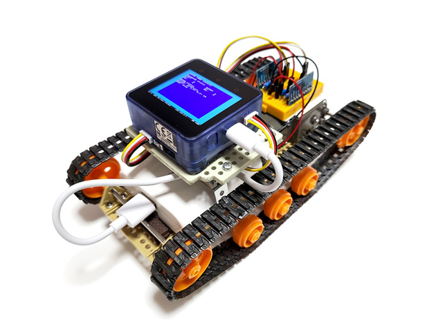
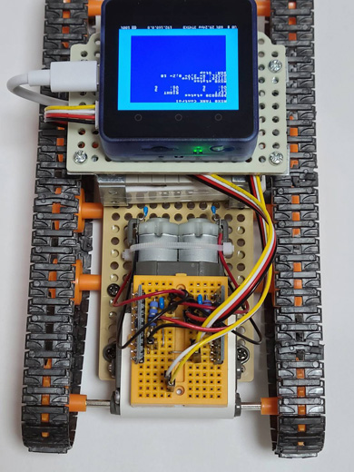
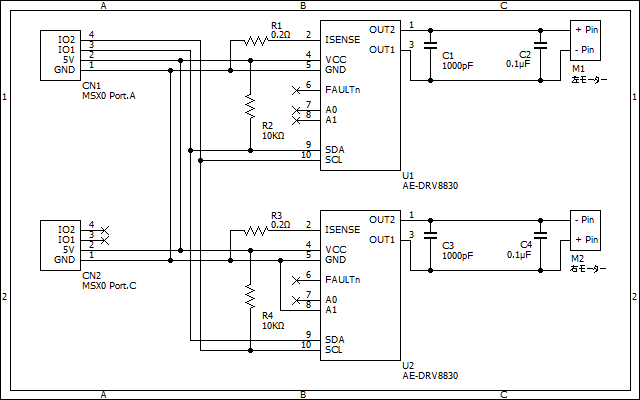

# MSX0戦車コントロールプログラム
  
MSX0 Stackを用いたラジコン戦車「MSX0戦車」のコントロールプログラムです。  
このプログラムでは、MSX0 StackのPort.Aに接続されたモータードライバDRV8830を介して[タミヤ製ツインモーターギヤボックス](https://www.tamiya.com/japan/products/70097/)を操作しています。  
また、おまけ機能として、IMU6軸センサの状態表示と、BGMの再生機能があります。

## 動作環境
- MSX0 Stack
（※MSX0 M5GO BATT Bottom2 を装着していること）  
- Port.A にDRV8830を2つ接続すること。
（右モーター用 I2C アドレス：0x64、左モーター用 I2C アドレス：0x61）
- 組み立て済みのタミヤ製ツインモーターギヤボックス

## モータードライバ周辺回路
 

### 部品リスト
- AE-DRV8830　x 2　秋月電子製の DRV8830 モーターモジュール  
- ブレッドボード x 1　4.5cm × 3.4cm 程度の小型のもの  
- 抵抗：10k Ω x 2、　0.2 Ω x 2  
- セラミックコンデンサ：1000pF x 2、0.1uF x 1  
- Grove 4 ピンコネクタ - ジャンパーピン変換ケーブル x 2 　MSX0 の GROVE コネクタとモータードライバ回路との接続に使用。  
- ジャンパーワイヤ（オス－オス）　適量  
- 錫メッキ線　少量  
　（配線の短い箇所にジャンパーワイヤの代わりに使用　抵抗やコンデンサの足を切ったものでも可）　

### 回路図
  
モーター端子近接のコンデンサ(C2,C4)はモーター端子間に半田付けしてください。  
本来はPort.Cの接続は不要なのですが、Port.Aのみでは電源供給が不安定であったため、Port.Cとも5V・GNDを接続しています。  

## 実行方法
MSX0 Stackとモータードライバ周辺回路を接続した状態でMSX-BASICを起動し、MSX0TANK.BASを実行してください。  

## 操作方法

| 操作 | 入力 |
| - | - |
| 前進  | ⇧キー押下 |
| 前進（右方向）| ⇧⇨キー押下 |
| 前進（右旋回）| ⇨キー押下 |
| 前進（左旋回）| ⇦キー押下 |
| 前進（左方向）| ⇦⇧キー押下 |
| 後進| ⇩キー押下 |
| 後進（右方向）| ⇩⇨キー押下 |
| 後進（左方向）| ⇦⇩キー押下 |
| 停止| カーソルキーを離す |
| BGM 再生| m キー押下 |
